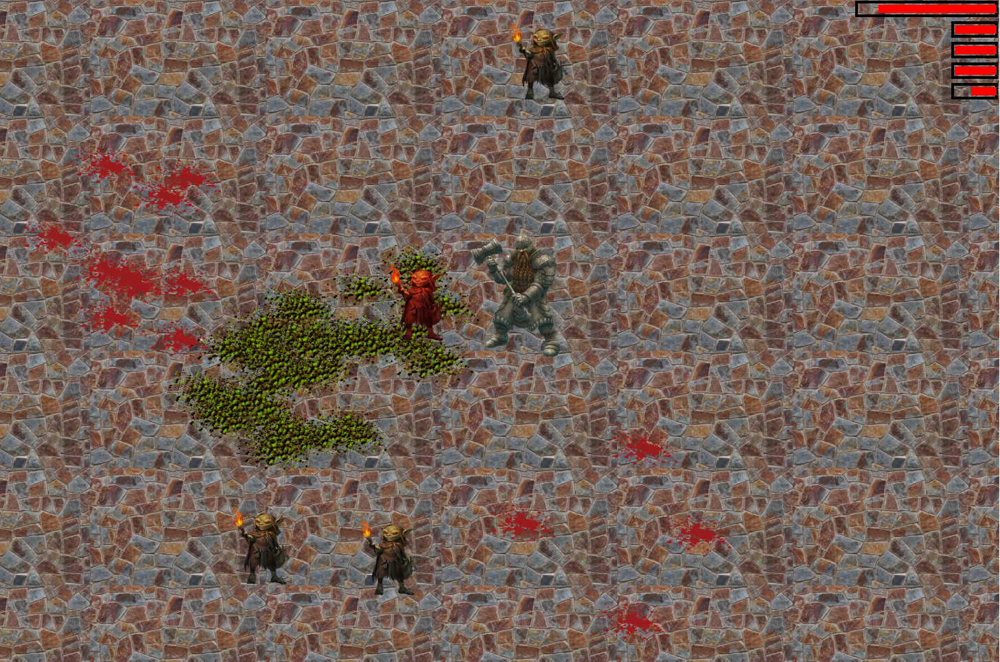

# Dwarves and goblins

A random JavaScript and Canvas demo I decided to mess with.

The idea is to have goblins to kill, maybe add some AI, etc.

## Running the game
* Just run an HTTP server in the main directory, like node's `httpserver`.
* Open a browser to the port it's serving at (`8080` for `httpserver` by default)

Alternatively, you can just see it on my netlify site: https://dwarf-castle.netlify.app/

## How to play
* Use arrow keys to move the dwarf around
* When the goblins get close, they'll attack and hurt your HP (top left bar)
* Use Spacebar to attack goblins when they are close

## Screenshot

